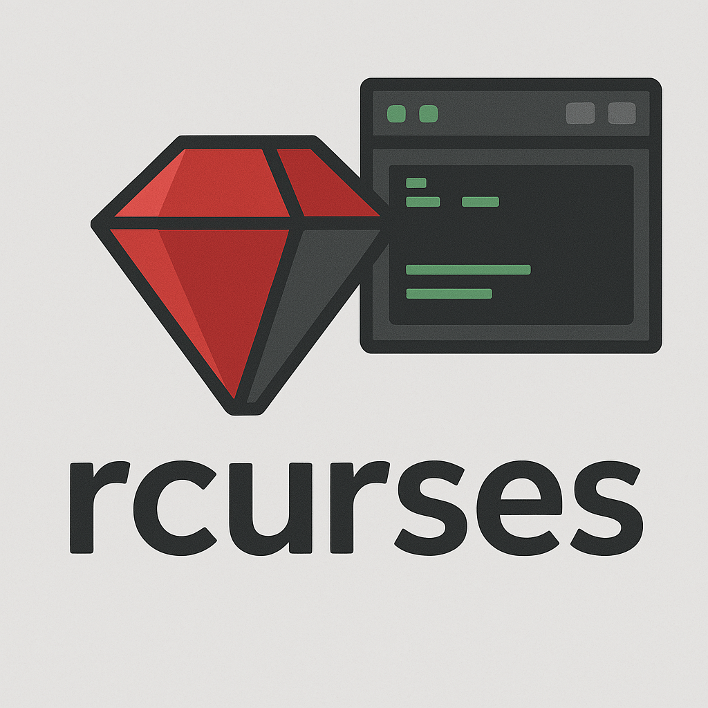

# rcurses - An alternative curses library written in pure Ruby
 
 [](https://badge.fury.io/rb/rcurses)  
 


Create curses applications for the terminal easier than ever.

Here's a somewhat simple example of a TUI program using rcurses: The [T-REX](https://github.com/isene/T-REX) calculator.

And here's a much more involved example: The [RTFM](https://github.com/isene/RTFM) terminal file manager.

# NOTE: Version 4.5 gives full RGB support in addition to 256-colors
Just write a color as a string - e.g. `"d533e0"` for a hexadecimal RGB color (or use the terminal 256 colors by supplying an integer in the range 0-255)

# Why?
Having struggled with the venerable curses library and the ruby interface to it for many years, I finally got around to write an alternative - in pure Ruby.

# Design principles
Simple and with minimum of external dependencies.

# Installation
Simply run `gem install rcurses`.

To use this library do:
```
require 'rcurses'
```

# Features
* Create panes (with the colors and(or border), manipulate the panes and add content
* Dress up text (in panes or anywhere in the terminal) in bold, italic, underline, reverse color, blink and in any 256 terminal colors for foreground and background
* Use a simple editor to let users edit text in panes
* Left, right or center align text in panes
* Cursor movement around the terminal

# The elements
`rcurses` gives you the following elements:
* The class `Pane` to create and manilpulate panes/boxes
* Extensions to the class String to print text in various degrees of fancy and also strip any fanciness
* A module `Cursor` to give you cursor movements around the terminal
* A module `Rinput` providing the function `getchr` to capture a single character input from the user (much better than any Ruby built-ins)

# class Pane
To create a pane do something like this:
```
mypane = Rcurses::Pane.new(80, 30, 30, 10, 19, 229)
```
This will create a pane/box starting at terminal column/x 80 and row/y 30 with the width of 30 characters and a hight of 10 characters and with the foreground color 19 and background color 229 (from the 256 choices available)

The format for creating a pane is:
```
Rcurses::Pane.new(x, y, w, h, fg, bg)
```
You can drop the last two 256-color codes to create a pane with the defaults for your terminal. 

By adding values for the terminal size in your program:
```
@max_h, @max_w = IO.console.winsize
```
...you can use these values to create proportinally sized panes. So, a hight value of "@max_h/2" is valid to create a pane with the height of half the terminal height (the integer corresponding to half the terminal height will then be accessible as the variable `h`). Use the variables `@max_h` for terminal height and `@max_w` for terminal width.

Avaliable properties/variables:

Property       | Description
---------------|---------------------------------------------------------------
x              | The x (column) position of the Pane
y              | The y (row) position of the Pane
w              | The width of the Pane
h              | The heigth of the Pane
fg             | Foreground color for the Pane
bg             | Background color for the Pane
border         | Draw border around the Pane (=true) or not (=false), default being false
scroll         | Whether to indicate more text to be shown above/below the Pane, default is true
text           | The text/content of the Pane
ix             | "Index" - the line number at the top of the Pane, starts at 0, the first line of text in the Pane
align          | Text alignment in the Pane: "l" = lefts aligned, "c" = center, "r" = right, with the default "l"
prompt         | The prompt to print at the beginning of a one-liner Pane used as an input box
moreup         | Set to true when there is more text above what is shown (top scroll bar i showing)
moredown       | Set to true when there is more text below what is shown (bottom scroll bar i showing)

The methods for Pane:

Method         | Description
---------------|---------------------------------------------------------------
new/init       | Initializes a Pane with optional arguments `x, y, w, h, fg and bg`
move(x,y)      | Move the pane by `x`and `y` (`mypane.move(-4,5)` will move the pane left four characters and five characters down)
refresh        | Refreshes/redraws the Pane with content
border_refresh | Refresh the Pane border only
full_refresh   | Refreshes/redraws the Pane with content completely (without diff rendering)
edit           | An editor for the Pane. When this is invoked, all existing font dressing is stripped and the user gets to edit the raw text. The user can add font effects similar to Markdown; Use an asterisk before and after text to be drawn in bold, text between forward-slashes become italic, and underline before and after text means the text will be underlined, a hash-sign before and after text makes the text reverse colored. You can also combine a whole set of dressings in this format: `<23,245,biurl\|Hello World!>` - this will make "Hello World!" print in the color 23 with the background color 245 (regardless of the Pane's fg/bg setting) in bold, italic, underlined, reversed colored and blinking. Hitting `ESC` while in edit mode will disregard the edits, while `Ctrl-S` will save the edits
editline       | Used for one-line Panes. It will print the content of the property `prompt` and then the property `text` that can then be edited by the user. Hitting `ESC` will disregard the edits, while `ENTER` will save the edited text
clear          | Clears the pane
say(text)      | Short form for setting panel.text, then doing a refresh of that panel
ask(prompt,text) | Short form of setting panel.prompt, then panel.text, doing a panel.editline and then returning panel.text
pagedown       | Scroll down one page height in the text (minus one line), but not longer than the length of the text
pageup         | Scroll up one page height in the text (minus one line)
linedown       | Scroll down one line in the text
lineup         | Scroll up one line in the text
bottom         | Scroll to the bottom of the text in the pane
top            | Scroll to the top of the text in the pane

# class String extensions
Method extensions provided for the class String.

A color can either be an integer in the range 0-255 for the usual 256 colors in a terminal, or it can be a string representing RGB. So both of these are valid: `string.fg(219)` and `string.fg("4d22a0")`.

Method         | Description
---------------|---------------------------------------------------------------
fg(fg)         | Set text to be printed with the foreground color `fg` (example: `"TEST".fg(84)`)
bg(bg)         | Set text to be printed with the background color `bg` (example: `"TEST".bg("dd32a9")`)
fb(fg, bg)     | Set text to be printed with the foreground color `fg` and background color `bg` (example: `"TEST".fb(84,196)`)
b              | Set text to be printed in bold (example: `"TEST".b`)
i              | Set text to be printed in italic (example: `"TEST".i`)
u              | Set text to be printed underlined (example: `"TEST".u`)
l              | Set text to be printed blinking (example: `"TEST".l`)
r              | Set text to be printed in reverse colors (example: `"TEST".r`)
c(code)        | Use coded format like "TEST".c("204,45,bui") to print "TEST" in bold, underline italic, fg=204 and bg=45 (the format is `.c("fg,bg,biulr")`)
pure           | Strip text of any "dressing" (example: with `text = "TEST".b`, you will have bold text in the variable `text`, then with `text.pure` it will show "uncoded" or pure text)
ansi_clean     | Strip seemingly uncolored strings of ansi code (those that are enclosed in "\e[0m"
shorten(n)     | Shorten the pure version of the string to 'n' characters, preserving any ANSI coding
inject("chars",pos) | Inject "chars" at position 'pos' in the pure version of the string (if 'pos' is '-1', then append at end). Preserves any ANSI code

PS: Blink does not work in conjunction with setting a background color in urxvt. It does work in gnome-terminal. But the overall performance in urxvt as orders of magnitude better than gnome-terminal.

# Cleaning up upon exit
End a program with `Rcurses.clear_screen` to clear the screen for any rcurses residues.

# module Cursor
To use this module, first do `include Rcurses::Cursor`. Create a new cursor object with `mycursor = Rcurses::Cursor`. Then you can apply the following methods to `mycursor`:

Method            | Description
------------------|---------------------------------------------------------------
save              | Save current position
restore           | Restore cursor position
pos               | Query cursor current position (example: `row,col = mycursor.pos`)
colget            | Query cursor current cursor col/x position (example: `row = mycursor.rowget`)
rowget            | Query cursor current cursor row/y position (example: `row = mycursor.rowget`)         
set(c = 1, r = 1) | Set the position of the cursor to row/y,col/x (example: `mycursor.set(row,col)`) (default = top row, first column)
col(c = 1)        | Cursor moves to the nth position horizontally in the current line (default = first column)
row(r = 1)        | Cursor moves to the nth position vertically in the current column (default = first/top row)
up(n = 1)         | Move cursor up by n (default is 1 character up)
down(n = 1)       | Move cursor down by n (default is 1 character down)
left(n = 1)       | Move cursor backward by n (default is one character)
right(n = 1)      | Move cursor forward by n (default is one character)
next_line         | Move cursor down to beginning of next line
prev_line         | Move cursor up to beginning of previous line
clear_char(n = 1) | Erase n characters from the current cursor position (default is one character)
clear_line        | Erase the entire current line and return to beginning of the line
clear_line_before | Erase from the beginning of the line up to and including the current cursor position
clear_line_after  | Erase from the current position (inclusive) to the end of the line
scroll_up         | Scroll display up one line
scroll_down       | Scroll display down one line
clear_screen_down | Clear screen down from current row
hide              | Hide the cursor
show              | Show cursor

# The function getchr
rcurses provides a vital extension to Ruby in reading characters entered by the user. This is especially needed for curses applications where readline inputs are required.
The function getchr is automatically included in your arsenal when you first do `include Rcurses::Input`.

Simply use `chr = getchr` in a program to read any character input by the user. The returning code (the content of `chr` in this example) could be any of the following:

Key pressed     | string returned
----------------|----------------------------------------------------------
`esc`           | "ESC"
`up`            | "UP"
`shift-up`      | "S-UP"
`ctrl-up`       | "C-UP"
`down`          | "DOWN"
`shift-down`    | "S-DOWN"
`ctrl-down`     | "C-DOWN"
`right`         | "RIGHT"
`shift-right`   | "S-RIGHT"
`ctrl-right`    | "C-RIGHT"
`left`          | "LEFT"
`shifth-left`   | "S-LEFT"
`ctrl-left`     | "C-LEFT"
`shift-tab`     | "S-TAB"
`insert`        | "INS"   
`ctrl-insert`   | "C-INS"
`del`           | "DEL"   
`ctrl-del`      | "C-DEL"
`pageup`        | "PgUP"  
`ctrl-pageup`   | "C-PgUP"
`pagedown`      | "PgDOWN"
`ctrl-pagedown` | "C-PgDOWN"
`home`          | "HOME"  
`ctrl-home`     | "C-HOME"
`end`           | "END"   
`ctrl-end`      | "C-END"
`backspace`     | "BACK"
`ctrl- `        | "C-SPACE"
`ctrl-h`        | "BACK"
`ctrl-a`        | "C-A"
`ctrl-b`        | "C-B"
`ctrl-c`        | "C-C"
`ctrl-d`        | "C-D"
`ctrl-e`        | "C-E"
`ctrl-f`        | "C-F"
`ctrl-g`        | "C-G"
`ctrl-i`        | "C-I"
`ctrl-j`        | "C-J"
`ctrl-k`        | "C-K"
`ctrl-l`        | "C-L"
`ctrl-m`        | "C-M"
`ctrl-n`        | "C-N"
`ctrl-o`        | "C-O"
`ctrl-p`        | "C-P"
`ctrl-q`        | "C-Q"
`ctrl-r`        | "C-R"
`ctrl-s`        | "C-S"
`ctrl-t`        | "C-T"
`ctrl-u`        | "C-U"
`ctrl-v`        | "C-V"
`ctrl-a`        | "WBACK"
`ctrl-x`        | "C-X"
`ctrl-y`        | "C-Y"
`ctrl-z`        | "C-Z"
`enter`         | "ENTER"
`tab`           | "TAB"
`F1` - `F12`    | "F1" - "F12"

Any other character enter will be returned (to `chr` in the example above).

In order to handle several character pased into STDIN by the user (and not only returned the first character only, your program should empty the STDIN like this:

```
while $stdin.ready?
  chr += $stdin.getc
end
```
You can also pass a timeout to `getchr` with `getchr(time)` to wait for `time` number of seconds and returning `nil` if the user does not press a key.


# Example

Try this in `irb`:
```
require 'rcurses'
@max_h, @max_w = IO.console.winsize
mypane = Pane.new(@max_w/2, 30, 30, 10, 19, 229)
mypane.border = true
mypane.text = "Hello".i + " World!".b.i + "\n \n" + "rcurses".r + " " + "is cool".c("16,212")
mypane.refresh
mypane.edit
```
... and then try to add some bold text by enclosing it in '*' and italics by enclosing text in '/'. Then press 'ctrl-s' to save your edited text - and then type `mypane.refresh` to see the result.

And - try running the example file `rcurses_example.rb`.

# Clean start and exit for your application
At the start of your program add these two lines to prevent any accidental
straggling character residues to appear in the terminal:
```
$stdin.raw!
$stdin.echo = false
```

To restore the terminal fully after you exit your application, add this:
```
at_exit do # Always restore terminal state on quit (or fatal)
  $stdin.cooked!
  $stdin.echo = true
  Rcurses.clear_screen
  Cursor.show
end
```

# Not yet implemented
Let me know what other features you like to see.

# License and copyright
Just steal or borrow anything you like. This is now Public Domain.
